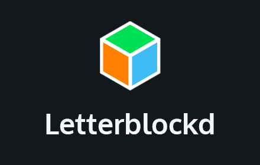

# Letterblockd

A Chrome extension for blocking Letterboxd users that you don't want to see reviews from. It removes content on the site by all people you add to your list in the options. 🤙

## What does it block by the users I list in the options?
- Reviews*
- Lists*
- Them being listed in lists of people*

\*  in all or most places(early version, folks)

You can still go their profile page, but you aren't going to see anything under "Recent activity", "Recent reviews" or "Popular reviews".

## Cool, how do I install it?
It's currently under review to be submitted to the Chrome webstore thing.

In the meantime you can run it yourself with these steps:

1.  Head on over to the [releases page](https://github.com/philedius/letterblockd/releases) and get the latest copy (The zip file).
2. Extract it wherever you want.
2. Put `chrome://extensions` in the URL bar in Chrome.
3. Toggle the "Developer Mode"
4. Click "Load unpacked"
5. Select the folder where you extracted the zip file.
7. Right-click the new extension icon and click options.
8. Follow the instructions on the options page.
9. Enjoy a better Letterboxd experience.

## 🚨 Holup! Now I dont see *any* reviews!
It doesn't load any new content to replace the removed content. So if you block a *whole* lot of people, especially popular ones, you ain't gonna see a bunch of reviews under "popular reviews" categories anymore. I made this extension basically as a band-aid until Letterboxd implements proper blocking themselves.

Created using [webextension-toolbox](https://github.com/HaNdTriX/webextension-toolbox)
